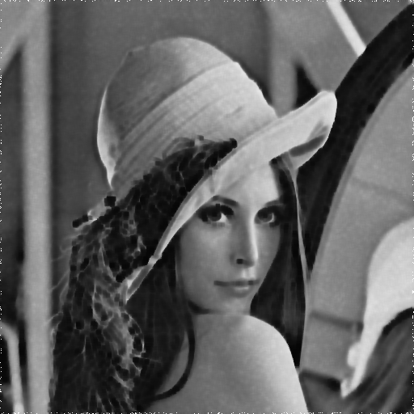

# 第六次作业

### 自动化少61 何奈特 2140506114

注：点击文中的[链接]()查看代码文件
报告中原始未压缩图片较多，加载时间会比较长

---

## 题目一

> 在测试图像上产生高斯噪声-需能指定均值和方差；并用多种滤波器恢复图像，分析各自优缺点；

* 计算机通常只能产生服从均匀分布的随机变量X（伪随机数序列），若要产生一般的随机分布Y，需要设计函数Y=g(X)将均匀分布进行转换，可以推导  。对于高斯分布  （标准正态分布），其积分  无法表示，概率论中常采用一维变二维的技巧，考虑  （转成极坐标），此时重积分可求  ，求反函数可得  ,  ，此即将  通过该变换可得  。实际上1-x与x是都是U(0,1)，可以简化为  ，然后再产生  的随机变量，乘以其sin或cos值就可以得到服从N(0,1)的随机变量。

* 产生高斯噪声的代码如下：（出自[hw6.cpp](hw6.cpp) - part 1）
```
inline double gaussianRand() {
	return sqrt(-2.0*log((double)rand()/32768.0)) * cos((double)rand()*M_PI/32768.0);
}
void addGaussianNoise(Bitmap *g, double mju, double sigma) {
	for(int i = 0; i < g->height; i++) for(int j = 0; j < g->width; j++) {
			double t =  g->px[i][j] + mju + sigma * gaussianRand();
			if(t > 255) t = 255; else if(t < 0) t = 0;
			g->px[i][j] = (int)t;
		}
}
```
* 下表是几个生成的例子：

|sigma = 10|sigma = 20
--|--|--
mju = 10||
mju = -10||

* （针对上面sigma=10,mju=10的那幅图像）下面分别采用空域中值（5*5）、空域高斯（5*5）和频域巴特沃斯（r=120,二阶）这三种平滑（低通）滤波器进行处理，主函数代码如下，其中有关BMP位图的操作可以在[bitmap.cpp](bitmap.cpp)中找到，三种滤波器都在[第四次作业](https://github.com/phaqew/hw4/blob/master/%E7%AC%AC4-%E6%AC%A1%E4%BD%9C%E4%B8%9A/report.md)和[第五次作业](https://github.com/phaqew/hw5/blob/master/report.md)中出现过，这里复用了以前的代码，详见[hw6.cpp](hw6.cpp) - part 2,3,4.
```
#include "hw6.cpp"
int main(){
	BMP256 p("lena.bmp");
	std::cout<<"lena.bmp read"<<std::endl;
	BMP256 p_gn(&p); addGaussianNoise(&p_gn, 10, 10);
	p_gn.addNameSuffix("_gn"); p_gn.writeFile();
	std::cout<<"gaussian noise added"<<std::endl;
	BMP256 p_gn_smf(&p_gn); sptMidFtr(&p_gn_smf, 5);
	p_gn_smf.addNameSuffix("_smf"); p_gn_smf.writeFile();
	std::cout<<"spatial midian filtering processed"<<std::endl;
	BMP256 p_gn_sgf(&p_gn); sptGsnFtr(&p_gn_sgf, 5);
	p_gn_sgf.addNameSuffix("_sgf"); p_gn_sgf.writeFile();
	std::cout<<"spatial gaussian filtering processed"<<std::endl;
	BMP256 p_gn_fbf(&p_gn); frqBtwFtr(&p_gn_fbf, 120, 2);
	p_gn_fbf.addNameSuffix("_fbf"); p_gn_fbf.writeFile();
	std::cout<<"frequency butterworth filtering processed"<<std::endl;
}
```
* 结果如下，可以看出，空域中值滤波边缘锐利，但丢失了许多细节；空域高斯滤波恢复了更多的细节，但边缘看上去较模糊；频域巴特沃斯细节更多，但为了滤除噪声必须选用较小的半径，出现了ringing效应。

叠加噪声后|
--|--
空域中值|
空域高斯|
频域巴沃|
原图|

---

## 题目二

> 在测试图像加入椒盐噪声（椒和盐噪声密度均是0.1）；使用逆谐波滤波器恢复图像，分析Q大于0和小于0的作用；

* 加入椒盐噪声十分简单，代码和例子如下：（出自[hw6.cpp](hw6.cpp) - part 5）
```
void addSaltPepperNoise(Bitmap *g, double r){
	for(int i = 0; i < g->height; i++) for(int j = 0; j < g->width; j++) {
			switch((int)((double)rand()/r/32768.0)){
				case 0:{ g->px[i][j] = 0; break;} //r概率加入椒噪声
				case 1:{ g->px[i][j] = 255; break;} //r概率加入盐噪声
			}
		}
}
```

原图|
--|--
椒盐0.1|
椒盐0.2|

* 逆谐波均值滤波器的表达式为：  ，其中S_xy是(x,y)的方形邻域（方便计算），代码详见[hw6.cpp](hw6.cpp) - part 6，其中求和时用了一些加速技巧。主函数中直接调用之（见[p2.cpp](p2.cpp)），结果很差，如图（方形邻域的边长为5）：

椒盐噪声图|
--|--
Q=+2|
Q=+1|
Q=0|
Q=-1|
Q=-2|

*注：由于大量零点的存在，Q<0的滤波已经无法正常进行*

* Q>0时只能用于消除椒噪声，Q<0时只能用于消除盐噪声！（Q=0是算术均值滤波器，都能处理但是效果较差）如果椒盐噪声都存在，就不适合采用谐波均值滤波。当然，如果只存在椒噪声或者只存在盐噪声，就可以取得较好的结果：

噪声类型|椒|盐
--|--
噪声图||
Q=+2||
Q=+1||
Q=0||
Q=-1||
Q=-2||

*注：纯椒噪声的Q<0与纯盐噪声的Q>0滤波结果与上面一样烂*

---

## 题目三

> 实现运动模糊，并叠加高斯噪声，用维纳滤波恢复之

* 运动模糊可以通过在频域乘滤波器函数  实现，代码见[hw6.cpp](hw6.cpp) - part 7. 效果如图所示：


